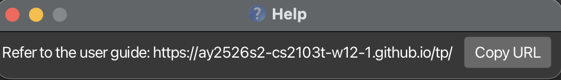

# CLInicDesk User Guide

CLInicDesk is a desktop application designed for **receptionists at small-scale medical clinics to manage patients, doctors, and appointments efficiently**.

CLInicDesk is optimized for use through a Command Line Interface (CLI) while still providing the convenience of a Graphical User Interface (GUI). CLInicDesk enables receptionists who can type quickly to perform clinic management tasks such as adding patients, viewing doctor availabilties, and booking appointments faster than traditional systems.

<!-- * Table of Contents -->
<page-nav-print />

--------------------------------------------------------------------------------------------------------------------

## Quick start

1. Ensure you have Java `17` or above installed in your Computer.<br>
   **Mac users:** Ensure you have the precise JDK version prescribed [here](https://se-education.org/guides/tutorials/javaInstallationMac.html).

1. Download the latest `.jar` file from [here](https://github.com/AY2526S2-CS2103T-W12-1/tp/releases).

1. Copy the file to the folder you want to use as the _home folder_ for your CLInicDesk.

1. Open a command terminal, `cd` into the folder you put the jar file in, and use the `java -jar clinicdesk.jar` command to run the application.<br>
   A GUI similar to the below should appear in a few seconds. Note how the app contains some sample data.<br>
   

1. Type the command in the command box and press Enter to execute it. e.g. typing **`help`** and pressing Enter will open the help window.<br>
   Some example commands you can try:

   * `list` : Lists all patients and doctors.

   * `adddoc n/John Doe p/98765432 e/johnd@doctor.com a/John street, block 123, #01-01` : Adds a doctor named `John Doe` to the application.

   * `deldoc 3` : Deletes the 3rd doctor shown in the current list.

   * `clear` : Deletes all contacts.

   * `exit` : Exits the app.

1. Refer to the [Features](#features) below for details of each command.

--------------------------------------------------------------------------------------------------------------------

## Features

<box type="info" seamless>

**Notes about the command format:**<br>

* Words in `UPPER_CASE` are the parameters to be supplied by the user.<br>
  e.g. in `adddoc n/NAME`, `NAME` is a parameter which can be used as `adddoc n/John Doe`.

* Items in square brackets are optional.<br>
  e.g `n/NAME [t/TAG]` can be used as `n/John Doe t/friend` or as `n/John Doe`.

* Items with `…`​ after them can be used multiple times including zero times.<br>
  e.g. `[t/TAG]…​` can be used as ` ` (i.e. 0 times), `t/friend`, `t/friend t/family` etc.

* Parameters can be in any order.<br>
  e.g. if the command specifies `n/NAME p/PHONE_NUMBER`, `p/PHONE_NUMBER n/NAME` is also acceptable.

* Extraneous parameters for commands that do not take in parameters (such as `help`, `list`, `exit` and `clear`) will be ignored.<br>
  e.g. if the command specifies `help 123`, it will be interpreted as `help`.

* If you are using a PDF version of this document, be careful when copying and pasting commands that span multiple lines as space characters surrounding line-breaks may be omitted when copied over to the application.
</box>

### Viewing help : `help`

Shows a message explaining how to access the help page.



Format: `help`


### Adding a doctor: `adddoc`

Adds a doctor to the app.

Format: `adddoc n/NAME p/PHONE_NUMBER e/EMAIL a/ADDRESS…​`

Examples:
* `adddoc n/John Doe p/98765432 e/johnd@doctor.com a/John street, block 123, #01-01`
* `adddoc n/Betsy Crowe e/betsycrowe@doctor.com a/Newgate Hospital p/1234567`

### Listing all persons : `list`

Shows a list of all persons (doctors and patients) in the app.

Format: `list`

### Locating persons by name: `find`

Finds persons whose names contain any of the given keywords.

Format: `find KEYWORD [MORE_KEYWORDS]`

* The search is case-insensitive. e.g `hans` will match `Hans`
* The order of the keywords does not matter. e.g. `Hans Bo` will match `Bo Hans`
* Only the name is searched.
* Only full words will be matched e.g. `Han` will not match `Hans`
* Persons matching at least one keyword will be returned (i.e. `OR` search).
  e.g. `Hans Bo` will return `Hans Gruber`, `Bo Yang`

Examples:
* `find John` returns `john` and `John Doe`
* `find alex david` returns `Alex Yeoh`, `David Li`<br>
  

### Deleting a doctor : `deldoc`

Deletes the specified doctor from the app.

Format: `deldoc INDEX`

* Deletes the doctor at the specified `INDEX`.
* The index refers to the index number shown in the displayed do list.
* The index **must be a positive integer** 1, 2, 3, …​


Examples:
- The list may be as follows:
  1. Patient
  2. Doctor
  3. Patient

To delete the doctor, type `deldoc 2`

### Viewing a doctor's schedule : `viewsched`

Displays all appointment slots for a specific doctor on a given date, showing whether each slot is available or booked.

Format: `viewsched d/DOCTOR_NAME date/DATE`

<box type="info" seamless>

**Notes:**
* `DOCTOR_NAME` must match an existing doctor's name. The match is case-insensitive. e.g. `john tan` will match `John Tan`.
* `DATE` must be in the strict `YYYY-MM-DD` format. Other formats such as `22-02-2026` or `Feb 22 2026` are not accepted.
* The date cannot be in the past.
* Appointment slots are displayed in half-hourly intervals from 09:00 to 17:00.

</box>

<box type="tip" seamless>

**Tip:** Use `viewsched` before booking an appointment with `addappt` to confirm which slots are free, so you can advise the patient on available timings.

</box>

Examples:
* `viewsched d/John Tan date/2026-02-22` displays John Tan's schedule on 22 Feb 2026.
* `viewsched d/Alice Lim date/2026-03-01` displays Alice Lim's schedule on 1 Mar 2026.

Expected output:
```
Schedule for John Tan on 2026-02-22

09:00 – Available
09:30 – Booked
10:00 – Available
10:30 – Available
11:00 – Booked
11:30 – Available
12:00 – Available
12:30 – Available
13:00 – Booked
13:30 – Available
14:00 – Available
14:30 – Available
15:00 – Available
15:30 – Booked
16:00 – Available
16:30 – Available
17:00 – Available
```

### Clearing all entries : `clear`

Clears all entries from the app UI temporarily. This does not delete data.

Format: `clear`

### Exiting the program : `exit`

Exits the program.

Format: `exit`

--------------------------------------------------------------------------------------------------------------------

## Saving the data

CLInicDesk data are saved in the hard disk automatically after any command that changes the data. There is no need to save manually.

--------------------------------------------------------------------------------------------------------------------

## Editing the data files

* The doctors' data is saved automatically to the JSON file `[JAR file location]/data/doctors.json`. Advanced users are welcome to update data directly by editing that data file.

* The patients' data is saved automatically to the JSON file `[JAR file location]/data/patients.json`. Advanced users are welcome to update data directly by editing that data file.

* Appointment data is saved automatically to the JSON file `[JAR file location]/data/schedule.json`. Advanced users are welcome to update data directly by editing that data file.

<box type="warning" seamless>

**Caution:**
If your changes to the data file makes its format invalid, CLInicDesk will discard all data and start with an empty data file at the next run.  Hence, it is recommended to take a backup of the file before editing it.<br>
Furthermore, certain edits can cause the CLInicDesk to behave in unexpected ways (e.g., if a value entered is outside the acceptable range). Therefore, edit the data file only if you are confident that you can update it correctly.
</box>

--------------------------------------------------------------------------------------------------------------------

## FAQ

**Q**: How do I transfer my data to another Computer?<br>
**A**: Install the app in the other computer and overwrite the empty data file it creates with the file that contains the data of your previous CLInicDesk home folder.

--------------------------------------------------------------------------------------------------------------------

## Known issues

1. **When using multiple screens**, if you move the application to a secondary screen, and later switch to using only the primary screen, the GUI will open off-screen. The remedy is to delete the `preferences.json` file created by the application before running the application again.
2. **If you minimize the Help Window** and then run the `help` command (or use the `Help` menu, or the keyboard shortcut `F1`) again, the original Help Window will remain minimized, and no new Help Window will appear. The remedy is to manually restore the minimized Help Window.

--------------------------------------------------------------------------------------------------------------------

## Command summary

Action     | Format, Examples
-----------|----------------------------------------------------------------------------------------------------------------------------------------------------------------------
**Add Doctor**    | `addoc n/NAME p/PHONE_NUMBER e/EMAIL a/ADDRESS…​` <br> e.g., `adddoc n/James Ho p/22224444 e/jamesho@example.com a/123, Clementi Rd, 1234665`
**Clear**  | `clear`
**Delete Doctor** | `deldoc INDEX`<br> e.g., `deldoc 3`
**Find**   | `find KEYWORD [MORE_KEYWORDS]`<br> e.g., `find James Jake`
**List**   | `list`
**Help**   | `help`
