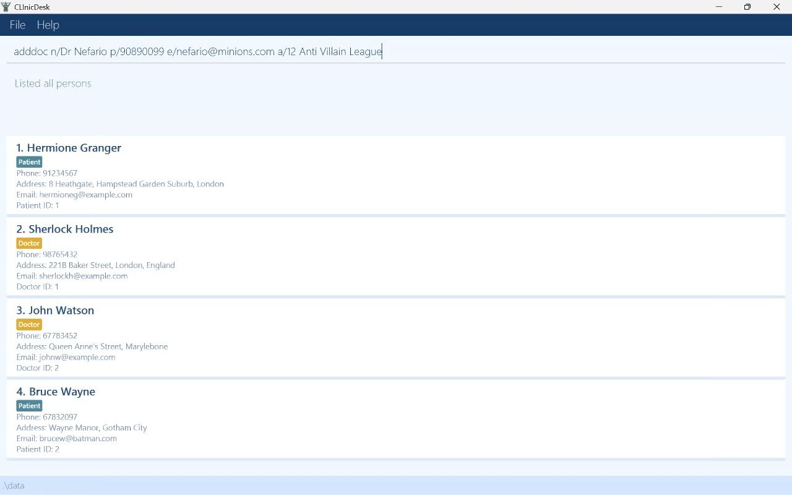
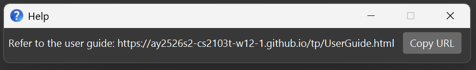
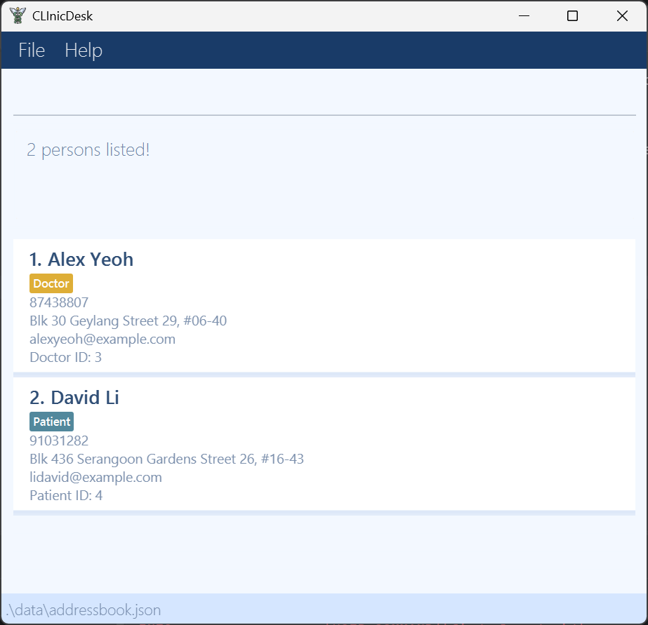

# CLInicDesk User Guide

CLInicDesk is a desktop application designed for **receptionists at small-scale medical clinics to manage patients, doctors, and appointments efficiently**.

CLInicDesk is optimized for use through a Command Line Interface (CLI) while still providing the convenience of a Graphical User Interface (GUI). CLInicDesk enables receptionists who can type quickly to perform clinic management tasks such as adding patients, viewing doctor availabilties, and booking appointments faster than traditional systems.

<!-- * Table of Contents -->
<page-nav-print />

--------------------------------------------------------------------------------------------------------------------

## Quick start

1. Ensure you have Java `17` or above installed in your Computer.<br>
   **Mac users:** Ensure you have the precise JDK version prescribed [here](https://se-education.org/guides/tutorials/javaInstallationMac.html).

1. Download the latest `.jar` file from [here](https://github.com/AY2526S2-CS2103T-W12-1/tp/releases).

1. Copy the file to the folder you want to use as the _home folder_ for your CLInicDesk.

1. Open a command terminal, `cd` into the folder you put the jar file in, and use the `java -jar clinicdesk.jar` command to run the application.<br>
   A GUI similar to the below should appear in a few seconds. Note how the app contains some sample data.<br>
   

1. Type the command in the command box and press Enter to execute it. e.g. typing **`help`** and pressing Enter will open the help window.<br>
   Some example commands you can try:

   * `list` : Lists all patients and doctors.

   * `adddoc n/John Doe p/98765432 e/johnd@doctor.com a/John street, block 123, #01-01` : Adds a doctor named `John Doe` to the application.

   * `deldoc 3` : Deletes the 3rd doctor shown in the current list.

    * `clear` : Deletes all contacts.

    * `exit` : Exits the app.

1. Refer to the [Features](#features) below for details of each command.

--------------------------------------------------------------------------------------------------------------------

## Features

<box type="info" seamless>

**Notes about the command format:**<br>

* Words in `UPPER_CASE` are the parameters to be supplied by the user.<br>
  e.g. in `adddoc n/NAME`, `NAME` is a parameter which can be used as `adddoc n/John Doe`.

* Items in square brackets are optional.<br>
  e.g `n/NAME [t/TAG]` can be used as `n/John Doe t/friend` or as `n/John Doe`.

* Items with `…`​ after them can be used multiple times including zero times.<br>
  e.g. `[t/TAG]…​` can be used as ` ` (i.e. 0 times), `t/friend`, `t/friend t/family` etc.

* Parameters can be in any order.<br>
  e.g. if the command specifies `n/NAME p/PHONE_NUMBER`, `p/PHONE_NUMBER n/NAME` is also acceptable.

* Extraneous parameters for commands that do not take in parameters (such as `help`, `list`, `exit` and `clear`) will be ignored.<br>
  e.g. if the command specifies `help 123`, it will be interpreted as `help`.

* If you are using a PDF version of this document, be careful when copying and pasting commands that span multiple lines as space characters surrounding line-breaks may be omitted when copied over to the application.
  </box>

### Viewing help : `help`

Shows a message explaining how to access the help page.



Format: `help`

### Adding an appointment : `addappt`
Adds an appointment on a specific date, at a specific time from a doctor's schedule.

Format: `addappt d/DOCTORNAME n/PATIENTNAME date/YYYY-MM-DD time/HH:MM`

* Books an appointment in the relevant doctor's schedule at the specified date and time
* Date must not fall beyond the 7 day range(counted from today's date)
* Time must fall within operating hours(9am to 5pm)

Examples:
* `addappt d/John Tan n/Jane date/2026-03-21 time/09:00` books an appointment for Jane in Dr John's schedule on 2026-03-21 at 9am, followed by
  `viewsched d/John Tan date/2026-03-21` command will show the 9am slot as `Booked`.

Expected output:
```
New appointment added!
```

### Adding a doctor: `adddoc`

Adds a doctor to the app.

Format: `adddoc n/NAME p/PHONE_NUMBER e/EMAIL a/ADDRESS…​`

Notes:
* `NAME` is the name of the patient. It should not be blank. Only alphabets and spaces are allowed.
* `PHONE_NUMBER` should only contain numbers.
* `EMAIL` must match standard email format

Examples:
* `adddoc n/John Doe p/98765432 e/johnd@doctor.com a/John street, block 123, #01-01`
* `adddoc n/Betsy Crowe e/betsycrowe@doctor.com a/Newgate Hospital p/1234567`

Expected output:
```
New doctor added: John Doe; Phone: 98765432; Email: johnd@doctor.com; Address: John street, block 123, #01-01; Tags:
```

### Adding a patient: `addpat`

Adds a patient to the app.

Format: `addpat n/NAME p/PHONE_NUMBER e/EMAIL a/ADDRESS…​`

Notes:
* `NAME` is the name of the patient. It should not be blank. Only alphabets and spaces are allowed.
* `PHONE_NUMBER` should only contain numbers.
* `EMAIL` must match standard email format

Examples:
* `addpat n/John Doe p/98765432 e/johnd@doctor.com a/John street, block 123, #01-01`
* `addpat n/Betsy Crowe e/betsycrowe@doctor.com a/Newgate Hospital p/1234567`

  Expected output:
```
New patient added: John Doe; Phone: 98765432; Email: johnd@example.com; Address: John street, block 123, #01-01; Tags:
```

### Editing a doctor: `editdoc`

Edits an existing doctor in the app.

Format: `editdoc INDEX [n/NAME] [p/PHONE] [e/EMAIL] [a/ADDRESS]`

Notes:
* Edits the doctor at the specified INDEX.
* The index refers to the index number shown in the displayed list of doctor's and/or patients. The index must be a positive integer 1, 2, 3, …​
* At least one of the following fields must be provided: name, phone, email, or address.
* Existing values will be updated to the input values.

Examples:
* `editdoc 1 p/91234567 e/johnd@doctor.com`
* `editdoc 2 n/Betsy Crower`

Expected output:
```
Edited Doctor: John Doe; Phone: 91234567; Email: johnd@doctor.com; Address: 21 Bencoolen; Tags:
```

### Listing all persons : `list`

Shows a list of all persons (doctors and patients) in the app.

Format: `list`

### Locating persons by name: `find`

Finds persons whose names contain any of the given keywords.

Format: `find KEYWORD [MORE_KEYWORDS]`

* The search is case-insensitive. e.g `hans` will match `Hans`
* The order of the keywords does not matter. e.g. `Hans Bo` will match `Bo Hans`
* Only the name is searched.
* Only full words will be matched e.g. `Han` will not match `Hans`
* Persons matching at least one keyword will be returned (i.e. `OR` search).
  e.g. `Hans Bo` will return `Hans Gruber`, `Bo Yang`

Examples:
* `find John` returns `john` and `John Doe`
* `find alex david` returns `Alex Yeoh`, `David Li`<br>
  

### Deleting an appointment : `delappt`
Deletes an appointment on a specific date, at a specific time to a doctor's schedule.

Format: `delappt d/DOCTORNAME n/PATIENTNAME date/YYYY-MM-DD time/HH:MM`

* Deletes the appointment in the relevant doctor's schedule at the specified date and time
* Date must not fall beyond the 7 day range(counted from today's date)
* Time must fall within operating hours(9am to 5pm)

Examples:
* If the 9am slot for Dr John Tan on 2026-03-21 was booked, then `delappt d/John Tan n/Jane date/2026-03-21 time/09:00`
  followed by `viewsched d/John Tan date/2026-03-21` command will show the 9am slot as `Available`.

Expected output:
```
Appointment deleted!
```

### Deleting a doctor : `deldoc`

Deletes the specified doctor from the app.

Format: `deldoc INDEX`

Notes:
* Deletes the doctor at the specified `INDEX`.
* The index refers to the index number shown in the displayed doctor list.
* The index **must be a positive integer** 1, 2, 3, …​


Examples:
- The list may be as follows:
    1. Patient
    2. Doctor
    3. Patient

To delete the doctor, type `deldoc 2`

Expected output:
```
Deleted Doctor: John Doe; Phone: 98765432; Email: johnd@doctor.com; Address: John street, block 123, #01-01; Tags:
```

### Deleting a patient : `delpat`

Deletes the specified patient from the address book.

Format: `delpat INDEX`

Notes:
* Deletes the person at the specified `INDEX`.
* The index refers to the index number shown in the displayed person list.
* The index **must be a positive integer** 1, 2, 3, …​

Examples:
* `delpat 2` deletes the 2nd person (if the 2nd person is a patient) in CLInicDesk.

Expected output:
```
Deleted Patient: John Doe; Phone: 98765432; Email: johnd@example.com; Address: John street, block 123, #01-01; Tags:
```

### Viewing a doctor's schedule : `viewsched`

Displays all appointment slots for a specific doctor for a week or on a given date, showing whether each slot is available or booked.

Format: `viewsched d/DOCTOR_NAME [date/DATE]`

<box type="info" seamless>

**Notes:**
* `DOCTOR_NAME` must match an existing doctor's name. The match is case-insensitive. e.g. `john tan` will match `John Tan`.
* `DATE` must be in the strict `YYYY-MM-DD` format. Other formats such as `22-02-2026` or `Feb 22 2026` are not accepted.
* The date cannot be in the past and must be within 7 days of local date.
* Appointment slots are displayed in half-hourly intervals from 09:00 to 17:00.

</box>

<box type="tip" seamless>

**Tip:** Use `viewsched` before booking an appointment with `addappt` to confirm which slots are free, so you can advise the patient on available timings.

</box>

Examples:
* `viewsched d/John Tan date/2026-02-22` displays John Tan's schedule on 22 Feb 2026.
* `viewsched d/Alice Lim` displays Alice Lim's schedule for next 7 days.

Expected output:
```
Schedule for John Tan on 2026-03-31

```

### Editing a patient's details : `editpat`

Edits the details of an existing patient in the app.
Format: `editpat INDEX n/NAME p/PHONE e/EMAIL a/ADDRESS`

**Notes:**
* Edits the patient at the specified `INDEX`.
* The index refers to the index number shown in the displayed list.
* The index **must be a positive integer** 1, 2, 3, …​
* There must be at least one field to edit. e.g. `editpat 2 n/John Doe` is acceptable, but `editpat 2` is not.


Examples:
* `editpat 2 n/John Doe` changes the name of a patient in the index to `John Doe`.

Expected output:
```
Edited Patient: John Doe; Phone: 91234567; Email: johndoe@example.com; Address: 123456; Tags: 
```
## Editing an appointment : `editappt` 
Edits the details of an existing appointment 
Format : `editappt d/OLD_DOCTOR date/OLD_DATE time/OLD_TIME (n/NEW_NAME) (d/NEW_DOC) (date/NEW_DATE) (time/NEW_TIME)`

**Notes**
* Edits the appointment at the old date and time for the old doctor
* The new fields in brackets are optional, but there must be at least one new field to edit. 
e.g. `editappt d/Louis date/2026-03-28 time/09:00 time/10:00` is acceptable and will rebook the slot to 10am 
for the same patient,but `editappt d/Louis date/2026-03-28 time/09:00` is invalid on its own.

Examples:
* `editappt d/Louis date/2026-03-28 time/09:00 d/Harvey time/10:00` edits the appointment to be with Dr Harvey instead of Dr Louis at 10am on the same date

### Clearing all entries : `clear`

Clears all entries from the app UI temporarily. This does not delete data.

Format: `clear`

### Exiting the program : `exit`

Exits the program.

Format: `exit`

--------------------------------------------------------------------------------------------------------------------

## Saving the data

CLInicDesk data are saved in the hard disk automatically after any command that changes the data. There is no need to save manually.

--------------------------------------------------------------------------------------------------------------------

## Editing the data files

* The doctors' data is saved automatically to the JSON file `[JAR file location]/data/doctors.json`. Advanced users are welcome to update data directly by editing that data file.

* The patients' data is saved automatically to the JSON file `[JAR file location]/data/patients.json`. Advanced users are welcome to update data directly by editing that data file.

* Appointment data is saved automatically to the JSON file `[JAR file location]/data/schedule.json`. Advanced users are welcome to update data directly by editing that data file.

<box type="warning" seamless>

**Caution:**
If your changes to the data file makes its format invalid, CLInicDesk will discard all data and start with an empty data file at the next run.  Hence, it is recommended to take a backup of the file before editing it.<br>
Furthermore, certain edits can cause the CLInicDesk to behave in unexpected ways (e.g., if a value entered is outside the acceptable range). Therefore, edit the data file only if you are confident that you can update it correctly.

</box>

### Archiving data files `[coming in v2.0]`

_Details coming soon ..._

--------------------------------------------------------------------------------------------------------------------

## FAQ

**Q**: How do I transfer my data to another Computer?<br>
**A**: Install the app in the other computer and overwrite the empty data file it creates with the file that contains the data of your previous CLInicDesk home folder.

--------------------------------------------------------------------------------------------------------------------

## Known issues

1. **When using multiple screens**, if you move the application to a secondary screen, and later switch to using only the primary screen, the GUI will open off-screen. The remedy is to delete the `preferences.json` file created by the application before running the application again.
2. **If you minimize the Help Window** and then run the `help` command (or use the `Help` menu, or the keyboard shortcut `F1`) again, the original Help Window will remain minimized, and no new Help Window will appear. The remedy is to manually restore the minimized Help Window.

--------------------------------------------------------------------------------------------------------------------

## Command summary

Action     | Format, Examples
-----------|----------------------------------------------------------------------------------------------------------------------------------------------------------------------
**Add Appointment** | `addappt d/DOCTOR_NAME n/PATIENT_NAME date/YYYY-MM-DD time/HH:MM` <br> e.g., `addappt d/James Ho n/Jane Tan date/2026-03-21 time/09:00`
**Add Doctor**    | `adddoc n/NAME p/PHONE_NUMBER e/EMAIL a/ADDRESS…​` <br> e.g., `adddoc n/James Ho p/22224444 e/jamesho@example.com a/123, Clementi Rd, 1234665`
**Add Patient** | `addpat n/NAME p/PHONE e/EMAIL a/ADDRESS` <br> e.g., `addpat n/James Ho p/22224444 e/jamesho@example.com a/123, Clementi Rd, 1234665`
**Clear**  | `clear`
**Delete Appointment** | `delappt d/DOCTOR_NAME n/PATIENT_NAME date/YYYY-MM-DD time/HH:MM` <br> e.g., `delappt d/James Ho n/Jane Tan date/2026-03-21 time/09:00`
**Delete Doctor** | `deldoc INDEX`<br> e.g., `deldoc 3`
**Delete Patient** | `delpat INDEX` <br> e.g., `delpat 2`
**Edit Patient** | `editpat INDEX n/NAME p/PHONE e/EMAIL a/ADDRESS` <br> e.g., `editpat 2 n/James Ho p/22224444
**Edit Appointment**|  `editappt d/OLD_DOCTOR date/OLD_DATE time/OLD_TIME (n/NEW_NAME) (d/NEW_DOC) (date/NEW_DATE) (time/NEW_TIME)` <br> e.g., `editappt d/Louis date/2026-03-28 time/09:00 d/Harvey time/10:00`p/22224444
**Exit** | `exit`
**Edit Doctor** | `editdoc INDEX [n/NAME] [p/PHONE] [e/EMAIL] [a/ADDRESS]`<br> e.g., `editdoc 1 p/91234567 e/johnd@doctor.com`
**Find**   | `find KEYWORD [MORE_KEYWORDS]`<br> e.g., `find James Jake`
**List**   | `list`
**View Schedule** | `viewsched d/DOCTOR_NAME [date/YYYY-MM-DD]`<br> e.g., `viewsched d/John Tan date/2026-03-20`
**Help**   | `help`
