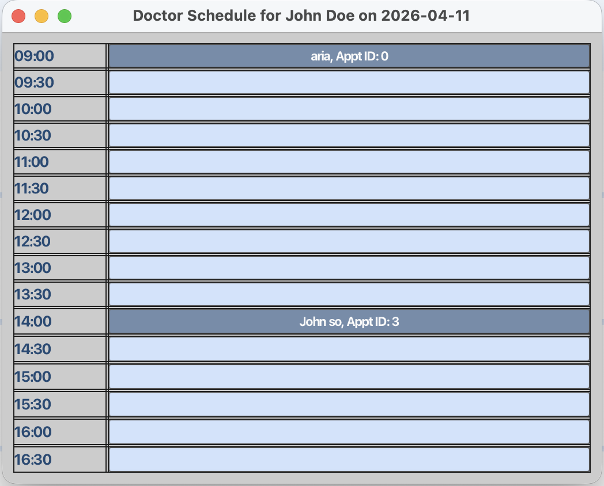
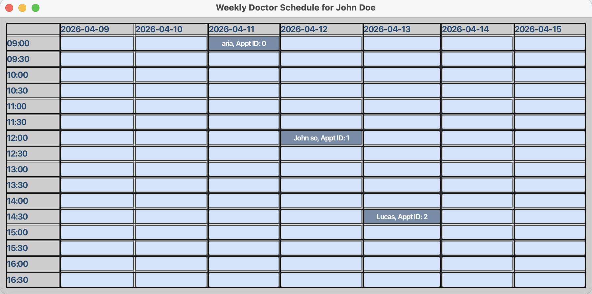

# CLInicDesk User Guide

CLInicDesk is a desktop application designed for **receptionists at small-scale medical clinics to manage patients, doctors, and appointments efficiently**.

CLInicDesk is optimized for use through a Command Line Interface (CLI) while still providing the convenience of a Graphical User Interface (GUI). CLInicDesk enables receptionists who can type quickly to perform clinic management tasks such as adding patients, viewing doctor availabilities, and booking appointments faster than traditional systems.

**Note:** This app is meant to be used with commands in English only.
<!-- * Table of Contents -->
<page-nav-print />

--------------------------------------------------------------------------------------------------------------------

## Setup Guidelines

<div class="quick-start-steps">

1. Ensure you have Java `17` or above installed in your Computer.<br>
   **Mac users:** Ensure you have the precise JDK version prescribed [here](https://se-education.org/guides/tutorials/javaInstallationMac.html).

1. Download the latest `.jar` file from [here](https://github.com/AY2526S2-CS2103T-W12-1/tp/releases).

1. Copy the file to the folder you want to use as the _home folder_ for your CLInicDesk.

1. Open a command terminal, `cd` into the folder you put the jar file in, and use the `java -jar clinicdesk.jar` command to run the application.<br>
   A GUI similar to the below should appear in a few seconds.<br>
   <div class="image-container">

   

   </div>

1. Type the command in the command box and press Enter to execute it. e.g. typing **`help`** and pressing Enter will open the help window.<br>
   Some example commands you can try:

   * `list` : Lists all patients and doctors.
   * `adddoc n/John Doe p/98765432 e/johnd@doctor.com a/John street, block 123, #01-01` : Adds a doctor named `John Doe`.
   * `deldoc 3` : Deletes the 3rd doctor shown in the current list.
   * `clear` : Clears all entries from the display.
   * `exit` : Exits the app.

1. Refer to the [Features](#features) below for details of each command.

</div>

--------------------------------------------------------------------------------------------------------------------

## Features

### Command format and input constraints

<table class="convention-table">
<tr><th>Convention</th><th>Meaning</th><th>Example</th></tr>
<tr><td><code>lower_case</code></td><td>A command</td><td><code>list</code></td></tr>
<tr><td><code>UPPER_CASE</code></td><td>A parameter you supply</td><td><code>adddoc n/NAME</code> → <code>adddoc n/John Doe</code></td></tr>
<tr><td><code>[square brackets]</code></td><td>Optional field</td><td><code>viewsched d/DOCTOR_NAME id/DOCTOR_ID [date/YYYY-MM-DD]</code></td></tr>
<tr><td>Any parameter order</td><td>Parameters can appear in any order</td><td><code>n/NAME p/PHONE</code> or <code>p/PHONE n/NAME</code></td></tr>
</table>

<box type="info" seamless>

**Good to know:**
* Commands that take no parameters (`help`, `list`, `exit`, `clear`) will ignore any extra text. e.g. `help 123` is treated as `help`.
* If copying commands from a PDF, watch out for missing spaces around line-breaks.

</box>

The table below summarises the rules and constraints for all input fields used across commands.

<table class="constraints-table">
<tr><th>Field</th><th>Constraints</th></tr>
<tr><td><strong>NAME</strong></td><td>Alphabets, hyphens, apostrophe and/or spaces only. Case-insensitive for matching (e.g. <code>john doe</code> matches <code>John Doe</code>). Must not be blank.</td></tr>
<tr><td><strong>PHONE_NUMBER</strong></td><td>Numeric digits only. Must be 8 digits long.</td></tr>
<tr><td><strong>EMAIL</strong></td><td>Must follow the standard <code>local-part@domain</code> format (e.g. <code>name@example.com</code>).</td></tr>
<tr><td><strong>ADDRESS</strong></td><td>Any non-blank string, minimum 3 characters.</td></tr>
<tr><td><strong>INDEX</strong></td><td>A positive integer (1, 2, 3, …) referring to the position in the currently displayed list.</td></tr>
<tr><td><strong>DOCTOR_ID / PATIENT_ID</strong></td><td>The numeric ID shown on each person's card in the displayed list. Must be a positive integer.</td></tr>
<tr><td><strong>APPOINTMENT_ID</strong></td><td>The numeric ID returned when an appointment is created via <code>addappt</code>. Must be a non-negative integer.</td></tr>
<tr><td><strong>DATE</strong> (<code>YYYY-MM-DD</code>)</td><td>Must be in strict ISO 8601 format (e.g. <code>2026-04-10</code>). Must be today or within the next 7 days.</td></tr>
<tr><td><strong>TIME</strong> (<code>HH:MM</code>)</td><td>Must be one of the half-hourly slots from <code>09:00</code> to <code>16:30</code> (i.e. <code>09:00</code>, <code>09:30</code>, <code>10:00</code>, … <code>16:30</code>).</td></tr>
<tr><td><strong>DOCTOR_NAME</strong></td><td>Must exactly match an existing doctor's name (case-insensitive). Used with <code>viewsched</code>.</td></tr>
</table>

<box type="info" seamless>

**Additional assumptions:**
* **Doctor duplicate detection:** Two doctors are considered duplicates if they share the same name (case-insensitive) **and** either the same phone number or the same email.
* **Patient duplicate detection:** Two patients are considered duplicates if they share the same name (case-insensitive) **and** the same email.
* **Schedule window:** Doctor schedules are displayed and bookable for a rolling 7-day window from today.
* **Schedule slots:** Schedule uses 30-minute slots from 09:00 to 16:30. Appointments can only be booked within these slots.
* **Doctor IDs:** Each doctor is automatically assigned a unique, persistent ID that is preserved across edits. IDs are not user-editable.
* **Patient IDs:** Each patient is automatically assigned a unique, persistent ID that is preserved across edits. IDs are not user-editable.
* **Appointment IDs:** Each appointment is automatically assigned a unique ID that is returned to the user when the appointment is created. IDs are not user-editable.
* **IDs do not exceed `Integer.MAX_VALUE`:** The system assumes the ID counter never overflows.

</box>

--------------------------------------------------------------------------------------------------------------------

### Managing doctors

Commands for adding, editing, and removing doctors from the system.

#### Adding a doctor : `adddoc`

Adds a doctor to the app.

Format: `adddoc n/NAME p/PHONE_NUMBER e/EMAIL a/ADDRESS`

**Notes:**
* `NAME` is the name of the doctor. It should not be blank. Only alphabets, followed by hyphens, apostrophe and/or spaces are allowed.
* `PHONE_NUMBER` should only contain numbers and be 8 digits.
* `EMAIL` must match the standard email format (e.g. `name@example.com`).

Examples:
* `adddoc n/John Doe p/98765432 e/johnd@doctor.com a/John street, block 123, #01-01`
* `adddoc n/Betsy Crowe e/betsycrowe@doctor.com a/Newgate Hospital p/12345678`

Expected output:
```
New doctor added: John Doe; Phone: 98765432; Email: johnd@doctor.com; Address: John street, block 123, #01-01; Tags: Doctor
```

#### Editing a doctor : `editdoc`

Edits an existing doctor in the app.

Format: `editdoc INDEX [n/NAME] [p/PHONE] [e/EMAIL] [a/ADDRESS]`

**Notes:**
* Edits the doctor at the specified `INDEX`.
* The index refers to the index number shown in the displayed list. The index must be a positive integer 1, 2, 3, …​
* At least one of the optional fields must be provided.
* Existing values will be updated to the input values.

Examples:
* `editdoc 1 p/91234567 e/johnd@doctor.com` updates the phone and email of the doctor at index 1.
* `editdoc 2 n/Betsy Crower` updates the name of the doctor at index 2.

Expected output:
```
Edited Doctor: John Doe; Phone: 91234567; Email: johnd@doctor.com; Address: 21 Bencoolen; Tags: Doctor
```

#### Deleting a doctor : `deldoc`

Deletes the specified doctor from the app.

Format: `deldoc INDEX`

**Notes:**
* Deletes the doctor at the specified `INDEX`.
* The index refers to the index number shown in the displayed list.
* The index **must be a positive integer** 1, 2, 3, …​

Examples:
* If the list shows (1) Patient, (2) Doctor, (3) Patient — type `deldoc 2` to delete the doctor.

Expected output:
```
Deleted Doctor: John Doe; Phone: 98765432; Email: johnd@doctor.com; Address: John street, block 123, #01-01; Tags: Doctor
```

--------------------------------------------------------------------------------------------------------------------

### Managing patients

Commands for adding, editing, and removing patients from the system.

#### Adding a patient : `addpat`

Adds a patient to the app.

Format: `addpat n/NAME p/PHONE_NUMBER e/EMAIL a/ADDRESS`

**Notes:**
* `NAME` is the name of the patient. It should not be blank. Only alphabets, followed by hyphens, apostrophe and/or spaces are allowed.
* `PHONE_NUMBER` should only contain numbers and be 8 digits.
* `EMAIL` must match the standard email format (e.g. `name@example.com`).

Examples:
* `addpat n/John Doe p/98765432 e/johnd@example.com a/John street, block 123, #01-01`
* `addpat n/Betsy Crowe e/betsycrowe@example.com a/Newgate Hospital p/12345678`

Expected output:
```
New patient added: John Doe; Phone: 98765432; Email: johnd@example.com; Address: John street, block 123, #01-01; Tags: Patient
```

#### Editing a patient : `editpat`

Edits the details of an existing patient in the app.

Format: `editpat INDEX [n/NAME] [p/PHONE] [e/EMAIL] [a/ADDRESS]`

**Notes:**
* Edits the patient at the specified `INDEX`.
* The index refers to the index number shown in the displayed list.
* The index **must be a positive integer** 1, 2, 3, …​
* At least one of the optional fields must be provided. e.g. `editpat 2 n/John Doe` is acceptable, but `editpat 2` is not.

Examples:
* `editpat 2 n/John Doe` changes the name of the patient at index 2 to `John Doe`.

Expected output:
```
Edited Patient: John Doe; Phone: 91234567; Email: johndoe@example.com; Address: 123456; Tags: Patient
```

#### Deleting a patient : `delpat`

Deletes the specified patient from the app.

Format: `delpat INDEX`

**Notes:**
* Deletes the patient at the specified `INDEX`.
* The index refers to the index number shown in the displayed list.
* The index **must be a positive integer** 1, 2, 3, …​

Examples:
* `delpat 2` deletes the 2nd entry in the displayed list, provided it is a patient.

Expected output:
```
Deleted Patient: John Doe; Phone: 98765432; Email: johnd@example.com; Address: John street, block 123, #01-01; Tags: Patient
```

--------------------------------------------------------------------------------------------------------------------

### Managing appointments

Commands for scheduling, modifying, and cancelling appointments, and viewing doctor schedules.

<box type="tip" seamless>

**Tip:** Use `viewsched` before booking an appointment with `addappt` to confirm which slots are free, so you can advise the patient on available timings.

</box>

#### Viewing a doctor's schedule : `viewsched`

Displays a doctor's schedule in a separate schedule panel, either for a specific date or for the next 7 days.

Format: `viewsched d/DOCTOR_NAME id/DOCTOR_ID [date/YYYY-MM-DD]`

**Notes:**
* `DOCTOR_NAME` must match an existing doctor's name. The match is case-insensitive, so `john tan` will match `John Tan`.
* `DOCTOR_ID` must match the doctor's assigned ID.
* `DATE` must be in the strict `YYYY-MM-DD` format. Other formats such as `22-02-2026` or `Feb 22 2026` are not accepted.
* If `date/` is omitted, `viewsched` shows the doctor's schedule for the next 7 days starting from today.
* If you request a date outside the available schedule window, the app shows `No schedule available for this date.`
* Appointment slots are displayed in half-hourly intervals from 09:00 to 16:30.
* The schedule panel uses light blocks for available slots and darker blocks for booked slots.

Examples:
* `viewsched d/John Tan id/1 date/2026-04-10` displays John Tan's schedule on 10 Apr 2026.
* `viewsched d/Alice Lim id/2` displays Alice Lim's schedule for the next 7 days.

Expected output:
```
Schedule for John Tan (ID: 1) on 2026-04-10
```

<div class="image-container">



</div>

<div class="image-container">



</div>


#### Adding an appointment : `addappt`

Books an appointment with a doctor for a patient on a specified date and time.

Format: `addappt id/DOCTOR_ID pid/PATIENT_ID date/YYYY-MM-DD time/HH:MM`

**Notes:**
* Books an appointment for the patient with the doctor at the specified date and time.
* Date must be in format YYYY-MM-DD (e.g. 2026-04-10).
* Time must be in 30-minute intervals from 09:00 to 16:30 (e.g. 09:00, 09:30, 10:00, …, 16:30).

Examples:
* `addappt id/1 pid/3 date/2026-04-10 time/09:00` books an appointment for patient 3 with doctor 1 on 2026-04-10 at 9am.

Expected output:
```
New appointment added! ID: X
```

#### Editing an appointment : `editappt`

Edits the details of an existing appointment.

Format: `editappt apptid/APPOINTMENT_ID [nid/NEW_DOCTOR_ID] [ndate/NEW_DATE] [ntime/NEW_TIME]`

**Notes:**
* Edits the appointment identified by its appointment ID.
* The new fields in square brackets are optional, but at least one new field must be provided.
* `nid/` is used to change the doctor (provide the doctor ID).
* `ndate/` is used to change the appointment date (format: YYYY-MM-DD).
* `ntime/` is used to change the appointment time (format: HH:MM, e.g. 09:00 or 9:00).

Examples:
* `editappt apptid/3 ntime/10:00` changes the appointment with ID 3 to 10:00.
* `editappt apptid/5 nid/2 ndate/2026-04-12` changes appointment 5 to be with doctor 2 on 2026-04-12.

Expected output:
```
Edited appointment!
```
<box type="warning" seamless>

**Warning:** Changing a patient for an appointment is not supported. Users will need to delete the appointment and make a new one.

</box>

#### Deleting an appointment : `delappt`

Deletes an appointment identified by its appointment ID.

Format: `delappt apptid/APPOINTMENT_ID`

**Notes:**
* Deletes the appointment identified by the appointment ID.
* The appointment ID is a unique identifier for each appointment.

Examples:
* `delappt apptid/3` deletes the appointment with ID 3.

Expected output:
```
Appointment deleted!
```

--------------------------------------------------------------------------------------------------------------------

### General

#### Listing all persons : `list`

Shows a list of all persons (doctors and patients) in the app.

Format: `list`

**Notes:**
* Any invalid or extra parameters added after the command will be ignored, and the `list` command will still work as intended. e.g. `list 3`, `list bla bla` will work.

#### Locating persons by name: `find`

Finds persons whose names contain any of the given keywords.

Format: `find KEYWORD [MORE_KEYWORDS]`

* The search is case-insensitive. e.g `hans` will match `Hans`
* The order of the keywords does not matter. e.g. `Hans Bo` will match `Bo Hans`
* Only the name is searched.
* Only full words will be matched e.g. `Han` will not match `Hans`
* Persons matching at least one keyword will be returned (i.e. `OR` search).
  e.g. `Hans Bo` will return `Hans Gruber`, `Bo Yang`

Examples:
* `find John` returns `john` and `John Doe`
* `find alex david` returns `Alex Yeoh`, `David Li`<br>
  <div class="image-container">

  

  </div>

#### Clearing all entries : `clear`

Clears all entries from the app display temporarily. Use `list` to show all entries again. This does not delete data.

Format: `clear`

#### Exiting the program : `exit`

Exits the program.

Format: `exit`

--------------------------------------------------------------------------------------------------------------------

## Data management

### Saving the data

CLInicDesk data is saved to the hard disk automatically after any command that changes the data. There is no need to save manually.

### Editing the data files

* Doctor data is saved automatically to `[JAR file location]/data/doctors.json`.
* Patient data is saved automatically to `[JAR file location]/data/patients.json`.
* Appointment data is saved automatically to `[JAR file location]/data/appointments.json`.
* Schedule data is saved automatically to `[JAR file location]/data/schedule.json`.

Advanced users are welcome to update data directly by editing these files.

<box type="warning" seamless>

**Caution:**
If your changes to a data file make its format invalid, CLInicDesk will discard all data and start with an empty data file at the next run. It is recommended to take a backup of the file before editing it.<br>
Furthermore, certain edits can cause CLInicDesk to behave in unexpected ways (e.g. if a value entered is outside the acceptable range). Therefore, edit the data files only if you are confident that you can update them correctly.

</box>

--------------------------------------------------------------------------------------------------------------------

## FAQ

**Q**: How do I transfer my data to another computer?<br>
**A**: Install the app on the other computer and overwrite the empty data files it creates with the files that contain the data from your previous CLInicDesk home folder.

--------------------------------------------------------------------------------------------------------------------

## Known issues

1. **When using multiple screens**, if you move the application to a secondary screen, and later switch to using only the primary screen, the GUI will open off-screen. The remedy is to delete the `preferences.json` file created by the application before running the application again.
2. **If you minimize the Help Window** and then run the `help` command (or use the `Help` menu, or the keyboard shortcut `F1`) again, the original Help Window will remain minimized, and no new Help Window will appear. The remedy is to manually restore the minimized Help Window.

--------------------------------------------------------------------------------------------------------------------

## Command summary

<table class="command-summary-table">
<tr>
  <th>Category</th>
  <th>Action</th>
  <th>Format &amp; Example</th>
</tr>
<tr>
  <td class="cat-doctor" rowspan="3">Doctor<br>Management</td>
  <td><strong>Add Doctor</strong></td>
  <td><code>adddoc n/NAME p/PHONE_NUMBER e/EMAIL a/ADDRESS</code><br>e.g., <code>adddoc n/James Ho p/22224444 e/jamesho@example.com a/123, Clementi Rd, 1234665</code></td>
</tr>
<tr>
  <td><strong>Edit Doctor</strong></td>
  <td><code>editdoc INDEX [n/NAME] [p/PHONE] [e/EMAIL] [a/ADDRESS]</code><br>e.g., <code>editdoc 1 p/91234567 e/johnd@doctor.com</code></td>
</tr>
<tr>
  <td><strong>Delete Doctor</strong></td>
  <td><code>deldoc INDEX</code><br>e.g., <code>deldoc 3</code></td>
</tr>
<tr class="cat-divider">
  <td class="cat-patient" rowspan="3">Patient<br>Management</td>
  <td><strong>Add Patient</strong></td>
  <td><code>addpat n/NAME p/PHONE_NUMBER e/EMAIL a/ADDRESS</code><br>e.g., <code>addpat n/James Ho p/22224444 e/jamesho@example.com a/123, Clementi Rd, 1234665</code></td>
</tr>
<tr>
  <td><strong>Edit Patient</strong></td>
  <td><code>editpat INDEX [n/NAME] [p/PHONE] [e/EMAIL] [a/ADDRESS]</code><br>e.g., <code>editpat 2 n/James Ho p/22224444</code></td>
</tr>
<tr>
  <td><strong>Delete Patient</strong></td>
  <td><code>delpat INDEX</code><br>e.g., <code>delpat 2</code></td>
</tr>
<tr class="cat-divider">
  <td class="cat-appt" rowspan="4">Appointment<br>Management</td>
  <td><strong>View Schedule</strong></td>
  <td><code>viewsched d/DOCTOR_NAME id/DOCTOR_ID [date/YYYY-MM-DD]</code><br>e.g., <code>viewsched d/John Tan id/1 date/2026-04-10</code></td>
</tr>
<tr>
  <td><strong>Add Appointment</strong></td>
  <td><code>addappt id/DOCTOR_ID pid/PATIENT_ID date/YYYY-MM-DD time/HH:MM</code><br>e.g., <code>addappt id/1 pid/3 date/2026-04-10 time/09:00</code></td>
</tr>
<tr>
  <td><strong>Edit Appointment</strong></td>
  <td><code>editappt apptid/APPOINTMENT_ID [nid/NEW_DOCTOR_ID] [ndate/NEW_DATE] [ntime/NEW_TIME]</code><br>e.g., <code>editappt apptid/3 ntime/10:00</code></td>
</tr>
<tr>
  <td><strong>Delete Appointment</strong></td>
  <td><code>delappt apptid/APPOINTMENT_ID</code><br>e.g., <code>delappt apptid/3</code></td>
</tr>
<tr class="cat-divider">
  <td class="cat-general" rowspan="5">General</td>
  <td><strong>Help</strong></td>
  <td><code>help</code></td>
</tr>
<tr>
  <td><strong>List</strong></td>
  <td><code>list</code></td>
</tr>
<tr>
  <td><strong>Find</strong></td>
  <td><code>find KEYWORD [MORE_KEYWORDS]</code><br>e.g., <code>find James Jake</code></td>
</tr>
<tr>
  <td><strong>Clear</strong></td>
  <td><code>clear</code></td>
</tr>
<tr>
  <td><strong>Exit</strong></td>
  <td><code>exit</code></td>
</tr>
</table>
